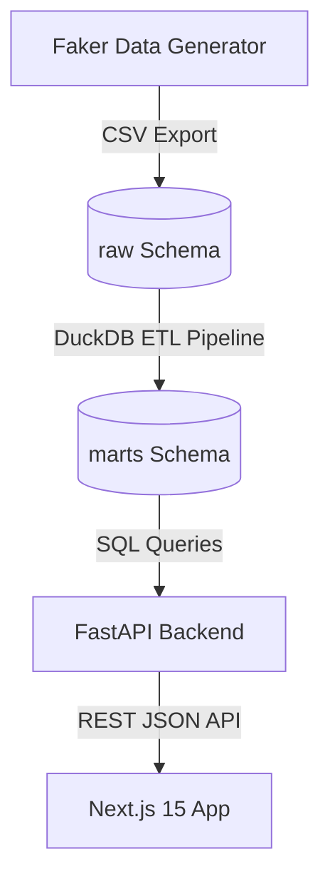

# E-Commerce Cohort Retention & Customer Analytics Platform

A production-ready data analytics platform that ingests customer transaction data, computes cohort retention, LTV, CAC, and RFM segmentation, and displays findings in a high-fidelity Next.js 15 dashboard.

## System Architecture & Tech Stack



- **Frontend:** Next.js 15 (React 19, App Router) + TypeScript
- **UI System:** Tailwind CSS v4 + Lucide Icons
- **Charts:** Recharts + Interactive SVG Heatmap
- **Backend:** FastAPI (Python 3.13) + Uvicorn
- **Database:** DuckDB 1.5 (In-process SQL Analytical Database)
- **Data transformations:** DuckDB SQL (PostgreSQL compatible)

---

## Folder Structure

```
├── data_pipeline/         # Data ETL and SQL transformations
│   ├── raw_data/          # Generated CSV raw tables
│   ├── sql/               # SQL script definitions (staging & marts)
│   ├── generate_data.py   # Synthetic e-commerce transactional data generator
│   └── run_pipeline.py    # Main ETL pipeline runner
├── backend/               # FastAPI Python application
│   ├── main.py            # API routing and DuckDB connections
│   ├── requirements.txt   # Python packages configuration
│   └── ecommerce.db       # Local DuckDB database file
└── frontend/              # Next.js React application
    ├── src/
    │   ├── app/           # App Router pages and global CSS styles
    │   ├── components/    # Reusable UI elements (Heatmap, Charts, Tables, Sidebar)
    │   ├── constants/     # Metric equations and lists constants
    │   ├── hooks/         # Search parameter custom state hooks
    │   ├── types/         # Typescript type declarations
    │   └── utils/         # Fetch API wrappers
    └── package.json       # Node package manager configurations
```

---

## Setup & Running Locally

Ensure you have **Python 3.12+** and **Node.js 18+** installed.

### 1. Ingest Data & Run the Pipeline
The pipeline generates mock data containing seasonal adjustments, channel retention curves, and refund scenarios, loading it directly into DuckDB and executing staging and mart SQL transformations.

```bash
# From the root directory
python data_pipeline/run_pipeline.py
```

### 2. Start the Backend API Server
The FastAPI server serves endpoints for KPIs, cohort matrices, channel CAC, and RFM scores on port 8000.

```bash
# Run the FastAPI app
python backend/main.py
```
*API documentation is auto-generated and viewable at [http://127.0.0.1:8000/docs](http://127.0.0.1:8000/docs).*

### 3. Start the Next.js Frontend
The frontend dashboard loads on port 3000.

```bash
# Navigate to the frontend directory
cd frontend
npm install
npm run dev
```
Open [http://localhost:3000](http://localhost:3500) to view the application.

---

## Database Schema (DuckDB)

### Raw Layer
- `raw_customers`: `customer_id` (PK), `email_hash`, `first_seen_at`, `acquisition_channel`, `country`, `signup_source`
- `raw_orders`: `order_id` (PK), `customer_id` (FK), `order_date`, `status` (completed/returned/cancelled), `total_amount`, `discount_amount`
- `raw_order_items`: `order_item_id` (PK), `order_id` (FK), `product_id`, `category`, `quantity`, `unit_price`
- `raw_refunds`: `refund_id` (PK), `order_id` (FK), `refund_date`, `refund_amount`
- `raw_marketing_spend`: `date`, `channel`, `spend_amount`

### Analytics Marts Layer
- `mart_customer_rfm`: Assigns Recency, Frequency, and Monetary scores (1-5) and segments customers (e.g. Champions, Loyal Customers, At Risk, Lost).
- `mart_customer_ltv`: Computes historical LTV (net of refunds) and projects 12-month future value based on purchase recency.
- `mart_channel_performance`: Aggregates customer acquisition cost (CAC) and LTV:CAC ratios per acquisition channel.

---

## Role-Based Access
- **Admin:** Full access. Can trigger a data warehouse rebuild by clicking **"Refresh Data"** in the sidebar (runs the Python ETL pipeline via `POST /api/refresh`).
- **Viewer:** Read-only access. The refresh option is disabled in the UI and restricted in the API.
